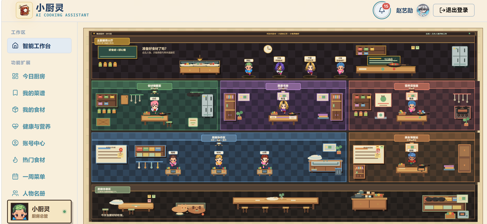
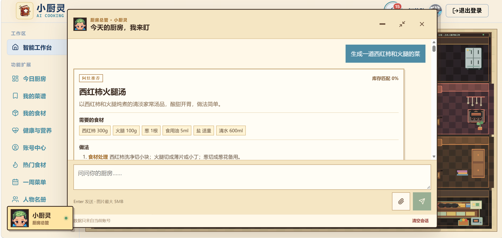
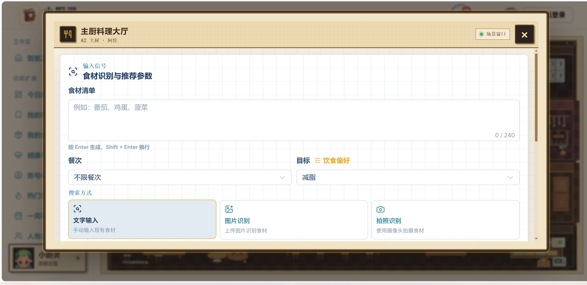
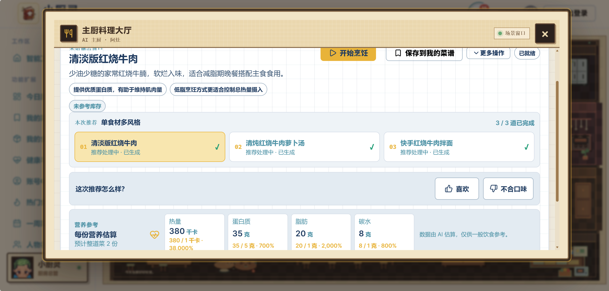

<h1 align="center">小厨灵｜多模态 AI 厨房助手</h1>

<p align="center">
  
  
  
  
  
  
  
  
  
  
</p>

<p align="center">
  <a href="README.md"><strong>中文</strong></a>
  &nbsp;·&nbsp;
  <a href="README.en.md">English</a>
</p>

面向家庭烹饪的多模态 AI 助手：输入或拍摄现有食材，获取结合饮食偏好的菜谱推荐；也可以和小厨灵对话，管理菜谱、库存与周菜单。

本项目是 Java 17、Spring Boot 3 与 Vue 3 构建的毕业设计项目，支持本地体验和 Docker Compose 部署。

## 产品预览



| 小厨灵 Agent 对话 | 食材识别与推荐入口 | 菜谱生成结果 |
| --- | --- | --- |
|  |  |  |

## 快速开始

本地方式适合首次体验：使用 H2 数据库和模拟短信，不需要 MySQL 或真实短信账号。Docker Compose 适合完整容器部署，但当前 Compose 配置使用生产模式，需要配置阿里云 PNVS 短信服务。

### 本地启动

需要 Java 17、Maven 3.8+ 和 Node.js 20+。在项目根目录打开两个终端：

终端一：启动后端（H2 数据库；Agent 状态暂存在内存中）

```powershell
$env:AGENT_STATE_STORE = 'memory'
$env:AGENT_RECOVERY_ENABLED = 'false'
mvn -f backend/pom.xml spring-boot:run
```

macOS/Linux 可使用：

```bash
AGENT_STATE_STORE=memory AGENT_RECOVERY_ENABLED=false mvn -f backend/pom.xml spring-boot:run
```

终端二：启动前端

```powershell
cd frontend
npm install
npm run dev
```

打开 `http://localhost:5173`。后端地址为 `http://localhost:7068`；前端开发服务器会将 `/api` 请求转发到后端。

本地默认使用 H2 内存数据库，重启后数据会清空；短信验证码使用仅供开发演示的 mock 模式，注册时验证码会自动填入。使用菜谱生成、食材识别或 Agent 前，需要配置兼容接口的模型 API Key。可设置 `DASHSCOPE_API_KEY`，也可在管理端配置模型；管理端保存的配置优先。

### Docker Compose 启动

需要 Docker Desktop（或 Docker Engine）和 Docker Compose v2。在项目根目录复制环境变量模板：

```powershell
Copy-Item .env.example .env
```

macOS/Linux：

```bash
cp .env.example .env
```

编辑 `.env`，至少替换数据库密码、32 字节以上的随机 `JWT_SECRET`，以及阿里云 PNVS 的 AccessKey、签名和模板编号。使用 AI 功能时还需配置 `DASHSCOPE_API_KEY`。

启动服务：

```bash
docker compose up -d --build
docker compose ps
```

浏览器访问 `http://localhost`。若 80 端口已被占用，在 `.env` 中设置 `FRONTEND_PORT=8080`，然后访问 `http://localhost:8080`。

> Compose 使用生产配置并强制启用真实 PNVS 短信服务；没有有效的 PNVS 配置时，后端不会启动。只想体验项目界面和模拟验证码，请使用上面的本地启动方式。

## 核心功能

- **食材识别**：手动输入、上传图片或拍照识别食材。
- **个性化菜谱**：结合食材、餐次、饮食偏好、健康档案和库存，生成菜谱、烹饪步骤、营养估算及缺料信息。
- **小厨灵 Agent**：通过对话查询和生成菜谱，并协助管理收藏、库存和周菜单；会影响用户数据的操作需要确认。
- **烹饪管理**：维护食材库存、采购清单和周菜单，并记录烹饪反馈。

## 技术栈

| 部分 | 技术 |
| --- | --- |
| 前端 | Vue 3、Vite 6、Element Plus、Pinia、Vue Router、Axios、ECharts、PixiJS |
| 后端 | Java 17、Spring Boot 3.3、Spring Security、JWT、MyBatis-Plus 3.5.7、Maven |
| 数据 | H2、MySQL 8.4、Redis 7.4、Flyway 11 |
| AI 与消息 | DashScope/Qwen 兼容接口、SSE 流式响应、阿里云 PNVS |
| 部署与测试 | Docker Compose、Nginx、JUnit 5、Mockito、Spring Boot Test |

## 相关文档

- [本地启动、API 与阿里云短信配置](docs/local-run-api-and-aliyun-sms.md)
- [腾讯云 TCR 镜像发布与 CDN 部署](docs/tencent-cloud-tcr-cdn-deployment.md)
- [English README](README.en.md)

## 安全提示

- 不要提交 `.env`、API Key、短信凭证、数据库密码或真实用户数据。
- Docker Compose 使用真实短信服务；生产部署请使用独立的随机 JWT 密钥，并修改初始管理员密码。
