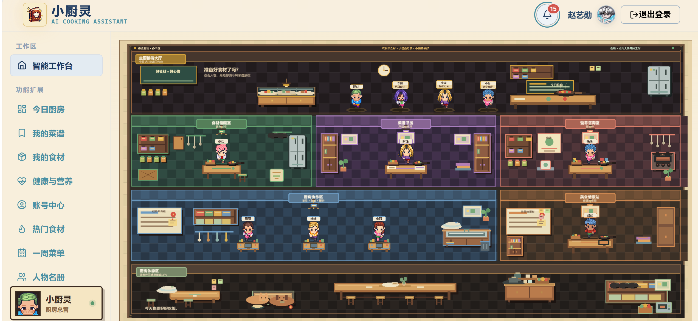
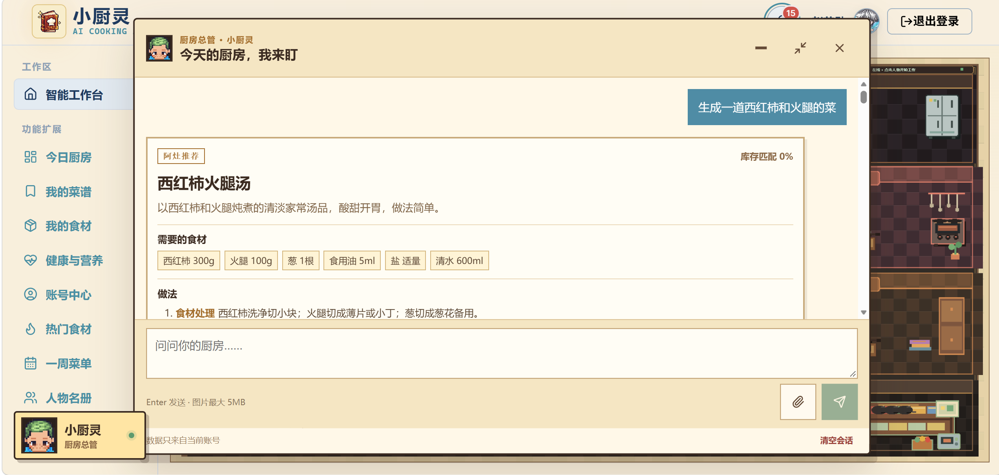
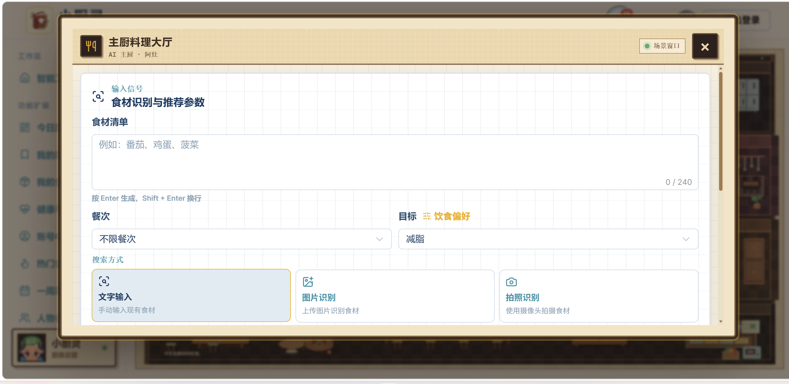
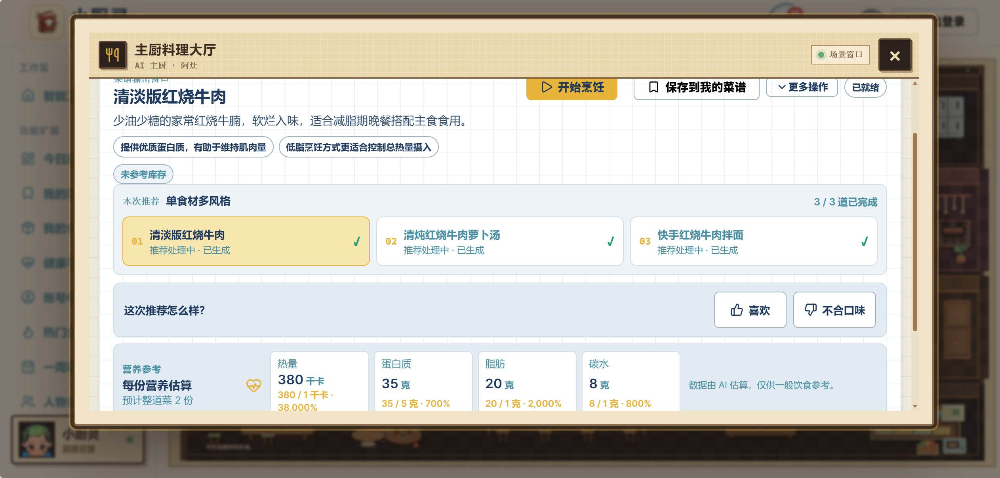

<h1 align="center">小厨灵｜多模态 AI 厨房助手</h1>

  
  
  
  
  
  
  
  
  
  
  

  <a href="README.md"><strong>中文</strong></a>
  &nbsp;·&nbsp;
  <a href="README.en.md">English</a>

小厨灵是一款面向家庭日常烹饪的多模态 AI 厨房助手：用户可以输入、上传或拍摄食材，获得结合饮食偏好与现有库存的菜谱建议；也可以和小厨灵 Agent 对话，持续管理饮食目标、菜谱、冰箱库存和周菜单。

项目把食材识别、菜谱推荐、烹饪记录和可由用户管理的长期饮食记忆串成完整流程。营养数据为 AI 估算，仅供日常饮食参考，不构成医疗诊断或专业营养建议。

本项目基于 Java 17、Spring Boot 3 与 Vue 3 构建，提供 H2 本地体验和 Docker Compose 容器部署。菜谱生成、食材识别和 Agent 需要配置兼容模型接口的 API Key。

## 快速开始

首次体验推荐本地启动：无需 MySQL 和真实短信账号，使用 H2 与开发用模拟短信。Docker Compose 启动完整容器环境，但需要真实阿里云 PNVS 短信配置。

### 本地启动

需要 Java 17、Maven 3.8+ 和 Node.js 20+。在项目根目录打开两个终端。

终端一：启动后端。使用 AI 功能时，启动前设置模型 API Key，或在管理端配置模型。

Windows PowerShell：

    $env:AGENT_STATE_STORE = 'memory'
    $env:AGENT_RECOVERY_ENABLED = 'false'
    $env:DASHSCOPE_API_KEY = 'your-api-key'
    mvn -f backend/pom.xml spring-boot:run

macOS/Linux：

    export AGENT_STATE_STORE=memory
    export AGENT_RECOVERY_ENABLED=false
    export DASHSCOPE_API_KEY=your-api-key
    mvn -f backend/pom.xml spring-boot:run

终端二：启动前端。

    cd frontend
    npm install
    npm run dev

打开 http://localhost:5173。前端开发服务器会把 /api 请求转发到 http://localhost:7068 后端。

本地使用 H2 内存数据库，重启后账号、菜谱、库存和长期记忆等数据会清空；Agent 对话状态也使用内存存储。开发模式的短信验证码为模拟流程，不需要真实短信凭证。不使用 AI 功能时可以不设置 DASHSCOPE_API_KEY。

### Docker Compose 启动

需要 Docker Desktop（或 Docker Engine）和 Docker Compose v2。在项目根目录创建环境文件：

Windows PowerShell：

    Copy-Item .env.example .env

macOS/Linux：

    cp .env.example .env

编辑 .env，替换数据库密码、至少 32 字节的随机 JWT_SECRET，并填写阿里云 PNVS 的 AccessKey、短信签名和模板编号。使用 AI 功能时还需设置 DASHSCOPE_API_KEY，或在管理端配置模型。

启动服务：

    docker compose up -d --build
    docker compose ps

浏览器访问 http://localhost。Compose 会启动前端、后端、MySQL、Redis 和 Qdrant；如 80 端口被占用，在 .env 中设置 FRONTEND_PORT=8080，再访问 http://localhost:8080。

Compose 使用生产配置并要求真实 PNVS 短信服务；配置无效时后端不会启动。停止服务但保留数据卷：

    docker compose down

## 核心功能

- **多模态食材识别：**手动输入、上传图片或使用摄像头识别食材，校对后再用于推荐。
- **个性化菜谱：**结合食材、餐次、口味、饮食限制、健康档案和库存推荐菜谱，并展示用量、分步做法、缺料提示与营养估算。
- **厨房 Agent：**多轮对话查询或生成菜谱，并协助管理收藏、冰箱库存和周菜单。新增、修改或消耗用户数据前会请求确认。
- **饮食与厨房管理：**维护个人饮食档案、食材库存、采购清单和周菜单，并记录烹饪反馈。
- **长期记忆饮食助手：**记住用户明确表达或确认的饮食偏好，在相关对话和推荐中按需参考。

### 长期记忆如何工作

- **记忆来源有边界：**可记录用户明确表达的食材喜好、饮食目标和烹饪偏好；也会参考收藏、菜谱反馈和成品评价等符合条件的行为。单次搜索或操作不会直接变成长期偏好。
- **重复行为谨慎归纳：**系统只从近期、重复且有多道不同菜谱支持的正向行为中归纳食材偏好；当前策略要求 90 天内至少 3 条支持行为、涉及至少 2 道不同菜谱。
- **饮食目标由用户决定：**从重复行为推测出的长期饮食目标会连同相关记录交给用户选择“确认长期记住”“不记住”或“仅本次”。未经确认的推测不会成为长期饮食偏好。
- **只在相关任务中召回：**提问涉及口味、饮食目标或菜谱选择时，Agent 才会检索相关记忆，不会把全部历史都带入每次回答。
- **记忆由用户掌控：**在“账号中心 → 记忆与个性化”中可以关闭个性化记忆、查看和修改单条记忆，或删除记忆。关闭后会暂停新的行为学习和回答召回，但保留已有记忆；清空记忆不会删除菜谱、收藏和冰箱库存。
- **持续反馈：**用户可以评价回答中的个人记忆是否有帮助，反馈这次个性化效果。

## 产品预览

| 小厨灵 Agent 对话 | 食材识别与推荐入口 | 菜谱生成结果 |
| --- | --- | --- |
|  |  |  |

## 技术栈

| 部分 | 技术 |
| --- | --- |
| 前端 | Vue 3、Vite 6、Element Plus、Pinia、Vue Router、Axios、ECharts、PixiJS |
| 后端 | Java 17、Spring Boot 3.3、Spring Security、JWT、MyBatis-Plus 3.5.7、Maven |
| 数据与检索 | H2、MySQL 8.4、Redis 7.4、Qdrant 向量检索、Flyway 11 |
| AI 与消息 | DashScope/Qwen 兼容模型接口、文本向量嵌入、SSE 流式响应、阿里云 PNVS |
| 部署 | Docker Compose、Nginx |

## 相关文档

- [本地启动、API 与阿里云短信配置](docs/local-run-api-and-aliyun-sms.md)
- [腾讯云 TCR 镜像发布与 CDN 部署](docs/tencent-cloud-tcr-cdn-deployment.md)
- [English README](README.en.md)

## 安全提示

- 不要提交 .env、API Key、短信凭证、数据库密码或真实用户数据。
- 生产部署请使用独立的随机 JWT 密钥，并修改初始管理员密码。
